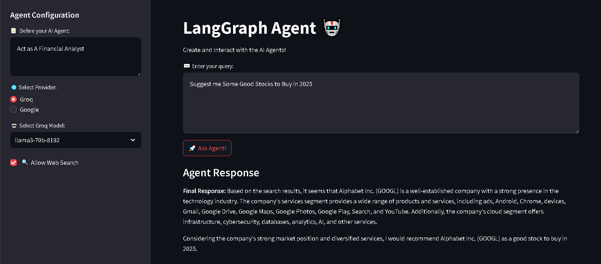

# LangGraph AI Agent



A powerful web interface for interacting with AI agents powered by different language models. The app lets you define and configure an AI agent, query it, and get responses. You can also enable external web search functionality for richer answers.

## Features

- **Interactive UI**: A simple Streamlit interface where users can configure AI agents.
- **Model Selection**: Choose between different AI models from Groq or Google.
- **System Prompt Customization**: Define the behavior of the AI by customizing its system prompt.
- **Web Search Integration**: Option to allow the agent to search the web for relevant information.
- **Flexible Backend**: FastAPI backend that processes requests and integrates with various AI models.

## Technologies Used

- **Streamlit**: For building the frontend user interface.
- **FastAPI**: For setting up the backend API endpoints.
- **Pydantic**: For data validation and ensuring the correct format is sent between frontend and backend.
- **Langchain**: To interact with different language models and tools.
- **External APIs**: Integrates with Groq, Google (Gemini), and Tavily search for external data queries.

## Installation

1. Clone the repository:

   ```bash
   git clone https://github.com/PriyanshuDey23/LangGraph-Chatbot.git
   cd <repo-folder>
   ```

2. Install dependencies:

   ```bash
   pip install -r requirements.txt
   ```

3. Set up environment variables for API keys:
   - Create a `.env` file in the project root with the following content:

     ```
     GROQ_API_KEY=<your-groq-api-key>
     TAVILY_API_KEY=<your-tavily-api-key>
     GOOGLE_API_KEY=<your-google-api-key>
     ```

## Running the Application

1. Start the backend server by running `backend.py`:

   ```bash
   python workflow/backend.py
   ```

2. In a new terminal window, start the Streamlit frontend by running `app.py`:

   ```bash
   streamlit run app.py
   ```

3. Open the provided URL in your browser, and you're ready to interact with the AI agent!

## Usage

1. **Configure Your Agent**:
   - Enter a system prompt to define the behavior of your AI agent.
   - Select the model provider (Groq or Google) and choose a model.
   - Optionally enable web search to allow the agent to look up external information.

2. **Ask Questions**: 
   - Type your question in the input box and click "Ask Agent!".
   - The agent will process your query and return a response based on the selected model and configured system prompt.

3. **Agent Response**: 
   - The response will be displayed below the input field. If the search option is enabled, it will also gather data from external sources.

## API Endpoint

The backend provides a RESTful API to interact with the AI agent:

- **Endpoint**: `/chat`
- **Method**: `POST`
- **Payload Format**:

  ```json
  {
    "model_name": "llama3-70b-8192",
    "model_provider": "Groq",
    "system_prompt": "Act as a friendly AI chatbot.",
    "messages": ["Hello, how are you?"],
    "allow_search": false
  }
  ```

## Contributing

Feel free to fork the repository, open issues, and submit pull requests. Contributions are welcome!

## License

This project is licensed under the MIT License - see the [LICENSE](LICENSE) file for details.

---
